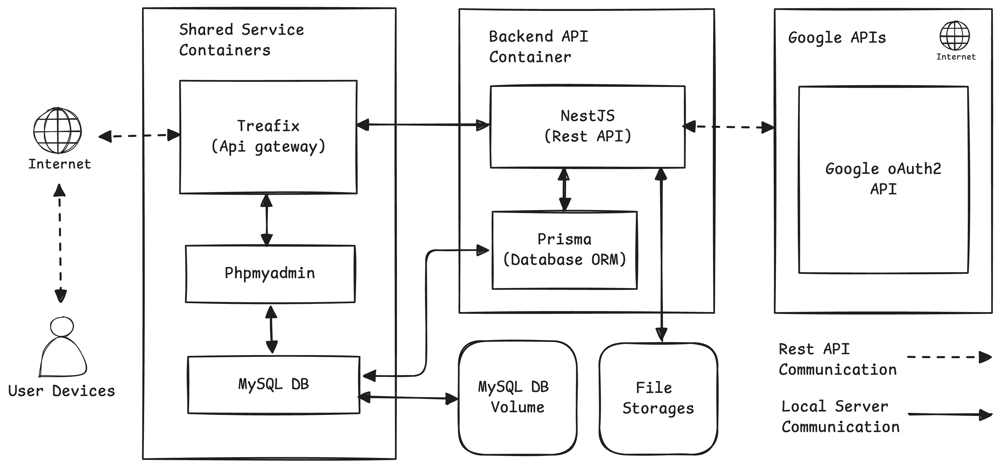

## About Project

Backend API untuk mengelola sumber daya aplikasi yang dibuat menggunakan fremework NestJS.

## Development Requirements
- Git
- NodeJS v20.x.x
- MySQL DB
- Postman

## Production Requirements
- Git
- Docker v25.x.x

## Software Architecture
Dibuat menggunakan https://excalidraw.com/

<center>
    
</center>

## Development Installations

Instalasi development tools:
- Install program Git. Download https://git-scm.com/downloads
- Instal interpreter NodeJS versi v20.x.x. Download https://nodejs.org/en
- Install database MySQL pada PC atau dapat menggunakan aplikasi XAMPP atau sejenisnya. Download XAMPP https://www.apachefriends.org/download.html
- Install postman untuk memanajemen API. Download https://www.postman.com/downloads

Instalasi dependency:
```sh
npm i -g ts-node
npm i -g @nestjs/cli
npm install
```

Setup environment variable:
- Salin file `.env.example` menjadi file `.env`
- Isi setiap variable sesuai dengan kebutuhan:
- `APP_PORT`: Port aplikasi yang akan digunakan.
- `APP_API_BASE_URL`: Host dimana aplikasi dijalankan.
- `APP_FREEZE`: Jika `true`, aplikasi aktif namun dalam keadaan freeze yang digunakan untuk proses database migration di production.
- `MAIN_DATABASE_URL`: Konfigurasi koneksi URI ke MySQL database.
- `GOOGLE_AUTH_CLIENT_ID` dan `GOOGLE_AUTH_CLIENT_SECRET`: Key untuk menggunakan OAuth google. Cara mendapatkannya https://developers.google.com/identity/protocols/oauth2
- `JWT_SECRET_KEY`: Kunci rahasia untuk proses penerbitan token login. Isi dengan karakter random dengan panjang 100 - 500 karakter.
- `SUPER_ADMIN_MAILS`: List email yang akan terdaftar sebagai super admin.
- `TZ`: Pilih timezone yang akan digunakan di aplikasi.

Jalankan migrasi database:
```sh
npm run migrate:deploy
```
```sh
npm run seed
```

Menjalankan aplikasi:
```sh
npm run start:dev
```

Backend API secara default dapat dibuka pada http://localhost:8000

Untuk mempermudah mengelola API, lakukan import file `/api.postman_collection.json` pada aplikasi postman.

## Production Installations

Siapkan Virtual Private Server (Debian/Ubuntu) 

Instalasi production tools:
- Install program Git. Download https://git-scm.com/downloads
- Install program Docker. Panduan https://docs.docker.com/engine/install/

Clone repository project di dalam VPS.
```sh
cd /home/<username>/artour-api
git clone git@github.com:neszha/artour-api.git
```

Berikutnya yaitu melaukan instalasi program shared service yang terdiri dari MySQL DB, Treafik, dan phpmyadmin. Salin file `.env.example` menjadi file `.env` pada folder `/shared-service` dan isi environment variable yang dibutuhkan. Setelah itu jalankan perintah berikut untuk menginstal dan menjalankan semua program:
```sh
cd shared-service
docker compose up -d
```

Dashboard phpmyadmin dapat diakses menggunakan URL https://artour-db.myexams.web.id

Lakukan setup environment variable aplikasi utama seperti yang telah di jelaskan di atas.
```sh
cp .env.example .env
nano .env
```

Pastikan docker telah terinstall di VPS dan jalankan perintah berikut untuk membuat file image:
```sh
sudo bash build.sh
```
<center>
    
</center>

Setelah itu jalankan perintah berikut untuk menjalankan program utama:
```sh
docker compose up -d
```

Jalankan perintah berikut untuk melihat daftar service yang berjalan:
```sh
docker stats
```
<center>
    
</center>

Tahapan selanjutnya yaitu melakukan proses migrate databse.
```sh
docker exec -it artour-api /bin/sh
npm run migrate:deploy
```

Akses aplikasi menggunakan URL https://artour.myexams.web.id

## Run Tests

Menjalankan load testing API.
```sh
npm install -g loadtest
```

Load test: Mendapatkan daftar rekomendasi tempat wisata.
```sh
loadtest -c 10 -n 500 -H "Authorization: Basic xxx" "https://artour.myexams.web.id/places/highlight"
```

Load test: Mendapatkan daftar lokasi terdekat.
```sh
loadtest -c 10 -n 500 -P '{"latitude": -5.358804, "longitude": 105.314882 }' -T "application/json" -H "Authorization: Basic xxx" "https://artour.myexams.web.id/places/nearest"
```

Load test: Mencari tempat wisata berdasarkan kata kunci.
```sh
loadtest -c 10 -n 500 -P '{"latitude": -5.358804, "longitude": 105.314882 }' -T "application/json" -H "Authorization: Basic xxx" "https://artour.myexams.web.id/places/map-search?keyword=pantai"
```

Load test: Mendapatkan daftar lokasi terdekat untuk AR Cam.
```sh
loadtest -c 50 -n 500 -P '{"latitude": -5.358804, "longitude": 105.314882 }' -T "application/json" -H "Authorization: Basic xxx" "https://artour.myexams.web.id/places/ar-map-search"
```

Menjalankan sekenario test pada directory `./test`.
```sh
npm run test
```
